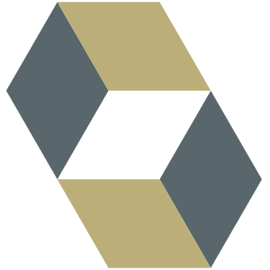
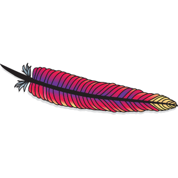

## Hello World. I'm Archit !! 👋

 

### I’m your typical fresh in the lot techie, trying to get my hands dirty in the field of computer science. 🖥️

 

 

 

### Languages and tools

  
  
  
  
  
  
  
  
  
  
  
  
  
  
  

 

### 2021 plans ??

-   🌱 I’m currently learning Java, GO, Kafka and a lot more things
-   👯 I’m looking to collaborate with other developers
-   🥅 2021 Goals: Contribute more to Open Source projects

 

### Connect with me:

 

  
  [][linkedin]
  [][medium]
  [][github]

 

## architsingh456@gmail.com

 

[linkedin]: https://www.linkedin.com/in/archit-singh-890203150/
[medium]: https://medium.com/@singh.archit1997
[github]: https://github.com/archit-1997
